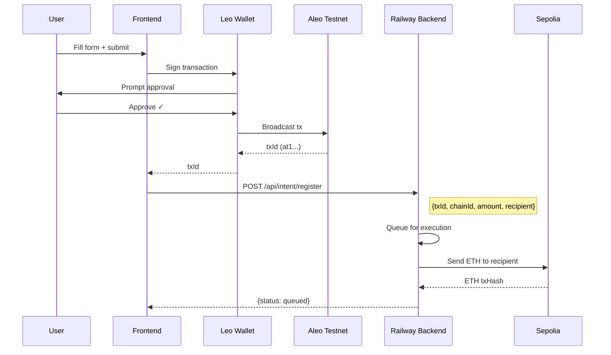

# 🔐 Privacy Bridge - Cross-Chain Private Transfers

[](https://explorer.aleo.org)
[](https://sepolia.etherscan.io)
[](https://amoy.polygonscan.com)

> **Private cross-chain bridge using Aleo's zero-knowledge cryptography.** Transfer assets from Aleo to EVM chains while keeping your transaction details hidden.


## 🌟 Features

| Feature | Description |
|---------|-------------|
| **🔒 Private Intents** | Your transfer amount, recipient, and chain are encrypted on Aleo |
| **🦁 Leo Wallet Signing** | Sign transactions with your own wallet - keys never leave your device |
| **⚡ Multi-Chain Support** | Bridge to Ethereum Sepolia and Polygon Amoy testnets |
| **🤖 Automated Relayer** | Backend handles EVM execution - no gas needed from users |
| **📊 Real-Time Telemetry** | Mission Control dashboard with live system status |

---

## 🏗️ Architecture

```
┌─────────────────────────────────────────────────────────────────────────────┐
│                              PRIVACY BRIDGE                                  │
├─────────────────────────────────────────────────────────────────────────────┤
│                                                                              │
│  ┌──────────────┐    ┌──────────────┐    ┌──────────────────────────────┐  │
│  │   FRONTEND   │    │  LEO WALLET  │    │        ALEO TESTNET          │  │
│  │  (Next.js)   │───▶│  (Browser)   │───▶│    advance_privacy.aleo      │  │
│  └──────────────┘    └──────────────┘    └──────────────────────────────┘  │
│         │                                              │                    │
│         │ POST /api/intent/register                    │ Transaction        │
│         ▼                                              ▼ confirmed          │
│  ┌──────────────────────────────────────────────────────────────────────┐  │
│  │                       RAILWAY BACKEND                                 │  │
│  │  ┌────────────┐  ┌───────────────┐  ┌────────────┐  ┌─────────────┐ │  │
│  │  │ Intent API │  │ Batch Queue   │  │ ETH Exec   │  │ Polygon Exec│ │  │
│  │  └────────────┘  └───────────────┘  └────────────┘  └─────────────┘ │  │
│  └──────────────────────────────────────────────────────────────────────┘  │
│         │                                              │                    │
│         │                                              │ Send ETH           │
│         ▼                                              ▼                    │
│  ┌──────────────────────────────────────────────────────────────────────┐  │
│  │                         EVM CHAINS                                    │  │
│  │        Sepolia (11155111)          │         Amoy (80002)            │  │
│  └──────────────────────────────────────────────────────────────────────┘  │
│                                                                              │
└─────────────────────────────────────────────────────────────────────────────┘
```

---

## 🔗 Hybrid Flow (Leo Wallet + Backend)

The bridge uses a **hybrid approach** that combines decentralized signing with automated execution:



### Why Hybrid?

| Approach | Pros | Cons |
|----------|------|------|
| **Wallet-only** | Fully decentralized | User needs gas on every chain |
| **Backend-only** | Simple, no gas needed | Centralized key management |
| **Hybrid ✓** | User controls Aleo key + No gas needed | Best of both worlds |

---

## 🦁 advance_privacy.aleo Program

The core Aleo program provides real privacy features using zero-knowledge proofs:

### Records (Private State)

```leo
// Private Vault - stores user's hidden balance
record Vault {
    owner: address,
    balance: u64,      // ENCRYPTED - only owner can see
}

// Private Intent - cross-chain transfer with hidden details
record Intent {
    owner: address,
    amount: u64,           // HIDDEN from observers
    dest_chain: u8,        // HIDDEN chain destination
    recipient_hash: field, // HASHED recipient address
    nonce: u64,
    is_compliant: bool,
}
```

### Key Functions

| Function | Purpose | Privacy Level |
|----------|---------|---------------|
| `init_vault` | Create private balance vault | 🔒 Private |
| `verify_balance` | Prove sufficient funds without revealing balance | 🔒 ZK Proof |
| `check_compliance` | Verify AML compliance without disclosure | 🔒 ZK Proof |
| `create_private_intent` | Full private cross-chain intent | 🔒 Private |
| `create_intent` | Simple intent (hybrid flow) | 🌐 Public |

### Privacy Features

1. **Hidden Amounts** - Transfer amounts encrypted in records
2. **Hidden Recipients** - Recipient hashed, only relayer knows mapping
3. **Balance Verification** - Prove you have funds without revealing how much
4. **Compliance Checks** - Prove AML compliance without disclosing amounts

---

## 📁 Project Structure

```
envelop/
├── frontend/                  # Next.js 16 frontend
│   ├── app/                   # App router pages
│   │   ├── page.tsx           # Landing - wallet connect
│   │   ├── mission/           # Telemetry dashboard
│   │   └── protocol/          # Bridge interface
│   ├── src/
│   │   ├── components/        # React components
│   │   │   ├── TransferForm.tsx     # Main bridge form
│   │   │   └── sections/            # Page sections
│   │   ├── services/          # API clients
│   │   ├── stores/            # Zustand state
│   │   └── providers/         # Wallet providers
│   └── .env.local             # Environment config
│
├── relayer/                   # Node.js backend
│   ├── api/                   # HTTP endpoints
│   │   ├── health.js          # Server + routes
│   │   ├── intent.js          # Intent creation/registration
│   │   └── telemetry.js       # Metrics endpoints
│   ├── services/              # Core services
│   │   ├── aleo.cli.service.js    # Leo CLI integration
│   │   └── aleo.transaction.service.js
│   ├── executor.eth.js        # Sepolia executor
│   ├── executor.polygon.js    # Amoy executor
│   ├── batch.queue.js         # Transaction batching
│   └── index.js               # Main entry
│
├── aleo/                      # Aleo programs
│   └── advance_privacy/       # Main privacy program
│       └── src/main.leo
│
└── docs/                      # Documentation
```

---

## 🚀 Quick Start

### Prerequisites

- Node.js 18+
- [Leo Wallet](https://chromewebstore.google.com/detail/leo-wallet/nebnhfamliijlghikdgcigoebonmoibm) browser extension
- Aleo testnet credits (get from [faucet](https://faucet.aleo.org))

### 1. Clone & Install

```bash
git clone https://github.com/SCARPxVeNOM/relayer.git
cd relayer

# Install dependencies
npm install
cd frontend && npm install
```

### 2. Configure Environment

```bash
# Frontend
cp frontend/.env.example frontend/.env.local

# Backend (for local development)
cp .env.example .env
```

Required variables:
```env
# Frontend
NEXT_PUBLIC_RELAYER_API_URL=https://privacy-bridge-relayer-production-faeb.up.railway.app

# Backend
RELAYER_PK=your_eth_private_key
ALCHEMY_ETH_RPC=https://eth-sepolia.g.alchemy.com/v2/YOUR_KEY
```

### 3. Run Locally

```bash
# Terminal 1: Backend
npm start

# Terminal 2: Frontend
cd frontend && npm run dev
```

Open http://localhost:3000

---

## 🌐 API Endpoints

| Endpoint | Method | Purpose |
|----------|--------|---------|
| `/health` | GET | Health check |
| `/api/telemetry` | GET | System metrics |
| `/api/latency` | GET | Network latency |
| `/api/session/init` | POST | Initialize session |
| `/api/intent` | POST | Create intent (backend signs) |
| `/api/intent/register` | POST | Register Leo Wallet intent |
| `/api/version` | GET | Version info |

### Register Intent (Hybrid Flow)

```bash
curl -X POST https://your-backend/api/intent/register \
  -H "Content-Type: application/json" \
  -d '{
    "txId": "at1abc123...",
    "chainId": 1,
    "amount": "0.01",
    "recipient": "0xYourEVMAddress"
  }'
```

---

## 🔒 Security Model

### What's Private

| Data | Visibility |
|------|------------|
| Your Aleo balance | 🔒 Only you (encrypted record) |
| Transfer amount | 🔒 Hidden in ZK proof |
| Intent details | 🔒 Encrypted on Aleo |
| Your identity | 🔒 Aleo address ≠ real identity |

### What's Public

| Data | Visibility | Mitigation |
|------|------------|------------|
| Relayer → Recipient ETH transfer | 🌐 On-chain | Batching, delays |
| Backend logs | ⚠️ Relayer knows mapping | Run your own relayer |

### Trust Assumptions

1. **You trust your Leo Wallet** - Keys never leave it
2. **Relayer can see the mapping** - Aleo tx → EVM recipient
3. **EVM is transparent** - Final ETH transfer is public

---

## 🛠️ Deployment

### Frontend (Vercel)

```bash
cd frontend
vercel deploy --prod
```

### Backend (Railway)

1. Connect GitHub repo to Railway
2. Set environment variables
3. Deploy from `main` branch

---

## 📊 Monitoring

### Railway Logs

View real-time logs at: https://railway.app/project/YOUR_PROJECT

### Telemetry Endpoints

- `/api/telemetry` - Full system metrics
- `/api/heartbeat` - Quick health check
- `/api/aleo/status` - Aleo network status

---

## 🤝 Contributing

1. Fork the repository
2. Create feature branch: `git checkout -b feature/amazing`
3. Commit changes: `git commit -m 'Add amazing feature'`
4. Push branch: `git push origin feature/amazing`
5. Open Pull Request

---

## 📄 License

MIT License - see [LICENSE](LICENSE) for details.

---

## 🔗 Links

- **Frontend**: [Live Demo](https://your-frontend.vercel.app)
- **Backend API**: https://privacy-bridge-relayer-production-faeb.up.railway.app
- **Aleo Explorer**: https://testnet.explorer.provable.com
- **Leo Wallet**: [Chrome Extension](https://chromewebstore.google.com/detail/leo-wallet/nebnhfamliijlghikdgcigoebonmoibm)

---

<p align="center">
  Built with 🔐 privacy in mind using <a href="https://aleo.org">Aleo</a> + <a href="https://ethereum.org">Ethereum</a>
</p>
